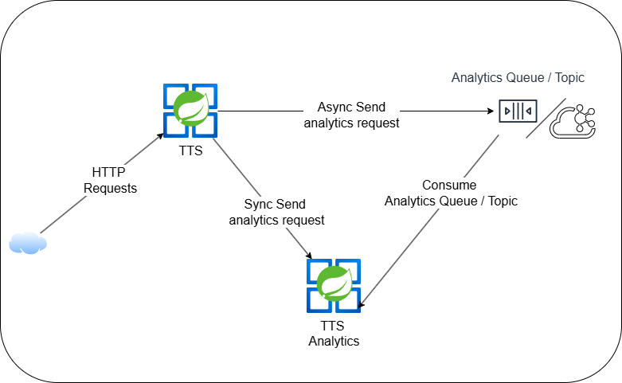

# **Spring Cloud Stram: write once, run anywhere**
In modern microservices architectures, asynchronous communication isn't just an option – it's the backbone of scalable, resilient systems. But let's face it: working directly with message brokers like RabbitMQ or Kafka often means drowning in boilerplate code, broker-specific configurations, and operational complexity.

Enter **Spring Cloud Stream** – the game-changing framework that transforms messaging from a technical hurdle into a strategic advantage. With its elegant abstraction layer, you can implement robust event-driven communication between services without tying your code to a specific broker.

In this article, I'll demonstrate how Spring Cloud Stream enabled me to:

1. **Build broker-agnostic producers/consumers** with identical code for RabbitMQ and Kafka
2. **Implement enterprise-grade messaging patterns** (retries, DLQs) in 3 lines of configuration
3. **Switch messaging technologies** with a single environment variable change
4. **Maintain focus on business logic** while the framework handles messaging plumbing

What these microservices do?

* TTS, exposing one endpoint that serves the purpose of converting text entered by user to speech using FreeTTS Java Library.
* TTS Analytics, a microservice that serves the role of doing analytics on user IP addresses and User Agent in order to provide device and country info (for this lab, we only mock this behavior).